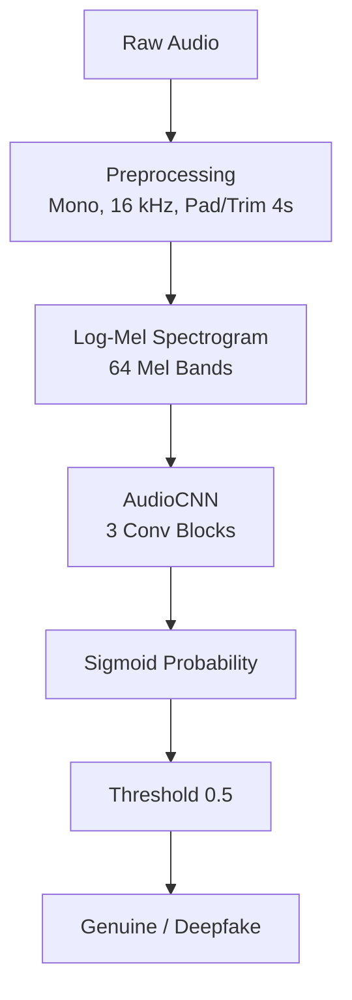

# Deepfake Audio Detection

A compact CNN-based system for classifying audio clips as **Genuine** or **Deepfake**, trained on the [Fake-or-Real (FoR) dataset](https://www.kaggle.com/datasets/mohammedabdeldayem/the-fake-or-real-dataset).

## Project Description

This project implements an end-to-end pipeline for detecting AI-generated (deepfake) speech using a lightweight 2D convolutional neural network operating on log-mel spectrograms. The model is trained, validated, and evaluated on the normalized training split of the FoR dataset, achieving strong overall accuracy with a low Equal Error Rate (EER).

The codebase is organized as a small Python package (`audio_detection`) with separate modules for configuration, data loading/labeling, feature extraction, model architecture, training, evaluation, and inference, plus a Jupyter notebook that runs the full workflow end-to-end (designed for Kaggle, where the dataset is attached via `kagglehub`), and a Streamlit app for interactive predictions.

## Project Workflow: Local Dev → Kaggle Training → Local Inference

This project is built around a deliberate two-environment arc, since the Fake-or-Real dataset is too large for a comfortable local disk footprint:

1. **Local development (low-disk)** — Write, test, and debug all pipeline code (`config.py`, `data.py`, `features.py`, `model.py`, `train.py`, `evaluate.py`, `inference.py`) against a small local sample, using `--sample-per-class` to limit how many files per class are loaded. This keeps iteration fast and avoids downloading the full dataset to your machine.
2. **Full training on Kaggle (KaggleHub)** — Once the code is verified, run the notebook (or `train.py --use-kagglehub`) inside a **Kaggle Notebook**. There, `kagglehub.dataset_download(...)` attaches the dataset through Kaggle's shared cache rather than downloading it to local/notebook disk, making full-scale training (53,868 examples) feasible. The trained artifacts — `deepfake_cnn.pth`, `model_config.json`, `metrics.json`, `confusion_matrix.png` — are then downloaded from Kaggle back to the local project.
3. **Local inference and demo** — With the trained artifacts placed in `models/` and `reports/`, run predictions locally via `predict.py` or the `inference.AudioPredictor` class, or launch the Streamlit app (`app.py`) for an interactive upload-and-classify demo. No large dataset is needed for this stage — only the small model checkpoint and config.

This arc means the dataset itself never needs to live on the local machine for more than smoke-testing; only the lightweight trained model and metrics travel back from Kaggle.

### KaggleHub Behavior

Outside Kaggle, `kagglehub.dataset_download(...)` downloads files into a local cache and can still require roughly dataset-sized disk space:

```python
import kagglehub

path = kagglehub.dataset_download("mohammedabdeldayem/the-fake-or-real-dataset")
print("Path to dataset files:", path)
```

Inside a Kaggle Notebook, the same call instead attaches the dataset through Kaggle's shared cache — this is the intended path for full training. `resolve_dataset_root` then auto-locates the normalized training split beneath the returned path; the current Kaggle archive commonly extracts it as `for-norm/for-norm/training`.

## Project Structure

```
audio_detection/
├── __init__.py           # Package marker
├── config.py             # AudioConfig and ModelConfig dataclasses
├── data.py               # Dataset discovery, label inference, manifest building
├── features.py           # Audio loading and log-mel spectrogram extraction
├── model.py              # AudioCNN architecture
├── train.py              # Training loop, stratified split, early stopping
├── evaluate.py           # Standalone evaluation script
├── inference.py          # AudioPredictor for single-file predictions
├── metrics.py            # Metric computation (accuracy, EER, F1, confusion matrix)
notebooks/
└── deepfake_audio_detection.ipynb   # End-to-end Kaggle workflow
models/
├── deepfake_cnn.pth      # Trained model weights
└── model_config.json     # Saved audio/model configuration
reports/
├── metrics.json          # Final evaluation metrics
└── confusion_matrix.png  # Confusion matrix visualization
```

## Methodology

### 1. Data Acquisition and Labeling

- The dataset is downloaded via `kagglehub` (`mohammedabdeldayem/the-fake-or-real-dataset`), or a local path can be supplied directly.
- `resolve_dataset_root` locates the normalized training split (e.g. `for-norm/for-norm/training`) by searching known layout patterns.
- `build_manifest` walks the directory, discovers all supported audio files (`.wav`, `.mp3`, `.flac`, `.ogg`, `.m4a`, `.aac`), and assigns binary labels (`0 = Genuine`, `1 = Deepfake`) using, in order of priority:
  1. Metadata files (CSV/TSV/protocol files) mapping filenames to labels
  2. Folder names containing label tokens (e.g. `bonafide`, `spoof`, `real`, `fake`)
  3. Filename tokens as a fallback
- The full training split contains **53,868 examples** (26,941 Genuine / 26,927 Deepfake), a near-perfectly balanced binary classification dataset.

### 2. Feature Extraction

Each audio clip is converted into a normalized log-mel spectrogram:

1. **Load** audio as mono at 16 kHz, padding or trimming to a fixed 4-second duration (64,000 samples).
2. **Mel spectrogram**: computed with 64 mel bands, FFT size 1024, hop length 256, frequency range 20 Hz – 7,600 Hz.
3. **Log scaling**: power spectrogram converted to decibels (`librosa.power_to_db`, referenced to max).
4. **Normalization**: per-sample z-score normalization (zero mean, unit variance with epsilon stabilization).

The resulting 2D spectrogram (64 mel bins × time frames) is used as a single-channel image input to the CNN.

### 3. Model Architecture (`AudioCNN`)

A compact 2D CNN designed for spectrogram inputs:

| Block | Layers |
|-------|--------|
| Conv Block 1 | Conv2d(1→16, 3×3) → BatchNorm → ReLU → MaxPool(2) |
| Conv Block 2 | Conv2d(16→32, 3×3) → BatchNorm → ReLU → MaxPool(2) |
| Conv Block 3 | Conv2d(32→64, 3×3) → BatchNorm → ReLU → AdaptiveAvgPool(1×1) |
| Classifier | Flatten → Dropout(0.25) → Linear(64→1) |

The model outputs a single logit, passed through a sigmoid to obtain the probability that a clip is a **Deepfake**.

### 4. Training

- **Split**: Stratified 80/20 train/validation split (per-class shuffling with a fixed seed for reproducibility).
- **Loss**: Binary cross-entropy with logits (`BCEWithLogitsLoss`), with `pos_weight` computed from the class imbalance in the training split to balance gradient contributions.
- **Optimizer**: AdamW (default `lr=1e-3`, `weight_decay=1e-4`).
- **Early stopping**: Training monitors validation EER and stops after a configurable number of epochs (`patience`, default 5) without improvement. The best-EER checkpoint is restored before final evaluation.
- **Default hyperparameters**: 30 epochs max, batch size 32, validation size 20%, seed 42.

In the recorded run, training proceeded for 22 epochs (early stopping triggered), with validation EER reaching as low as **0.0024** at its best epoch before settling on the final reported checkpoint.

### 5. Evaluation

`compute_metrics` produces:

- **Accuracy** — overall classification accuracy at the configured threshold (default 0.5)
- **Equal Error Rate (EER)** — the operating point where false positive rate equals false negative rate, computed by sweeping all unique score thresholds
- **F1 score** — harmonic mean of precision and recall (Deepfake = positive class)
- **Per-class accuracy** — accuracy broken down by Genuine vs. Deepfake
- **Confusion matrix** — raw counts of true/false positives and negatives

`save_metrics_report` writes `metrics.json` and renders a confusion matrix heatmap (`confusion_matrix.png`) using seaborn.

### 6. Inference

`AudioPredictor` (in `inference.py`) loads the saved model and config, and for a given audio file:

1. Computes the log-mel spectrogram
2. Runs it through `AudioCNN`
3. Applies sigmoid to get a deepfake probability
4. Thresholds against `config.threshold` to produce a `Genuine`/`Deepfake` label with a confidence score

```python
from audio_detection.inference import AudioPredictor

predictor = AudioPredictor(
    model_path="models/deepfake_cnn.pth",
    config_path="models/model_config.json",
)
result = predictor.predict("path/to/audio.wav")
print(result)
# {'label': 'Genuine', 'confidence': 0.97, 'deepfake_probability': 0.03, 'threshold': 0.5}
```

## Pipeline Summary


## Configuration

Stored in `model_config.json`:

```json
{
  "audio": {
    "sample_rate": 16000,
    "duration": 4.0,
    "n_mels": 64,
    "n_fft": 1024,
    "hop_length": 256,
    "fmin": 20,
    "fmax": 7600
  },
  "class_names": ["Genuine", "Deepfake"],
  "threshold": 0.5
}
```

## Results

Final evaluation on the held-out validation split:

| Metric | Value |
|--------|-------|
| Accuracy | **90.30%** |
| F1 Score | **0.893** |
| Equal Error Rate (EER) | **2.28%** |
| Genuine accuracy | **99.93%** |
| Deepfake accuracy | **80.67%** |

### Confusion Matrix

<div align="center">

```
┌──────────────────────┬────────────────────┬──────────────────────┐
│                      │ Predicted Genuine  │ Predicted Deepfake   │
├──────────────────────┼────────────────────┼──────────────────────┤
│ Actual Genuine       │       5384         │          4           │
├──────────────────────┼────────────────────┼──────────────────────┤
│ Actual Deepfake      │       1041         │        4344          │
└──────────────────────┴────────────────────┴──────────────────────┘
        
```
</div>

**Interpretation**: The model is extremely reliable at recognizing genuine audio (near-zero false positive rate), but misses roughly 19% of deepfake clips (false negatives), which pulls down the deepfake-class accuracy and overall F1 relative to accuracy. This asymmetry suggests the decision threshold (0.5) or class weighting could be tuned to trade off genuine-class precision for improved deepfake recall, depending on the deployment use case (e.g. lowering the threshold to catch more deepfakes at the cost of more false alarms on genuine audio).

## Usage

### Setup (local)

```bash
python -m venv .venv
source .venv/bin/activate
pip install -r requirements.txt
export PYTHONPATH=src
```

### 1. Local smoke test (low-disk)

Use a small local sample to verify the pipeline before running full training on Kaggle:

```bash
python -m audio_detection.train --data-root "/path/to/LA norm/train" --sample-per-class 100
```

### 2. Full training (Kaggle, recommended)

Run inside a Kaggle Notebook (or the provided `notebooks/deepfake_audio_detection.ipynb`), where `kagglehub` attaches the dataset via Kaggle's shared cache instead of downloading it:

```bash
python -m audio_detection.train --use-kagglehub --epochs 30 --batch-size 32
```

Training saves:

- `models/deepfake_cnn.pth`
- `models/model_config.json`
- `reports/metrics.json`
- `reports/confusion_matrix.png`

Download these four files from Kaggle back into the local project's `models/` and `reports/` directories before moving to local inference.

### 3. Evaluation

```bash
python -m audio_detection.evaluate --data-root "/path/to/LA norm/train" --model models/deepfake_cnn.pth
```

Reported metrics: overall accuracy, Equal Error Rate (EER), F1 score, per-class accuracy, and confusion matrix.

**Target gates:**

| Metric | Gate |
|--------|------|
| Accuracy | ≥ 80% |
| EER | ≤ 12% |
| F1 | ≥ 80% |
| Per-class accuracy | ≥ 75% |

The current run (see Results above) clears all four gates.

### 4. Inference

CLI:

```bash
python predict.py "/path/to/audio.wav" --model models/deepfake_cnn.pth --config models/model_config.json
```

Example output:

```json
{
  "label": "Deepfake",
  "confidence": 0.91,
  "deepfake_probability": 0.91,
  "threshold": 0.5
}
```

Python:

```python
from audio_detection.inference import AudioPredictor

predictor = AudioPredictor(
    model_path="models/deepfake_cnn.pth",
    config_path="models/model_config.json",
)
result = predictor.predict("path/to/audio.wav")
print(result)
# {'label': 'Genuine', 'confidence': 0.97, 'deepfake_probability': 0.03, 'threshold': 0.5}
```

### 5. Streamlit App

After downloading `deepfake_cnn.pth` and `model_config.json` from Kaggle into `models/`, run:

```bash
streamlit run app.py
```

Upload a `.wav`, `.mp3`, `.flac`, `.ogg`, or `.m4a` file. The app displays the predicted class and confidence.

### Demo Video Checklist

Screen Recording Demo :

[Demo Link](https://google.com)

## Dependencies

- `torch`
- `librosa`
- `numpy`
- `matplotlib`, `seaborn` 
- `kagglehub`                  (for dataset download)
- `streamlit`                  (for the interactive app)

Install with:

```bash
pip install -r requirements.txt
```

or individually:

```bash
pip install kagglehub librosa soundfile torch matplotlib seaborn streamlit
```

## Notes

- **Dataset files are intentionally ignored by Git** — only code, configs, and small result artifacts (`metrics.json`, `confusion_matrix.png`, model weights) are tracked.
- **Label discovery order**: the loader searches protocol/metadata files first, then class-named folders, then filename tokens. If labels cannot be inferred unambiguously, training fails with a clear error instead of silently using wrong labels.
- **Generalization**: the model is trained and validated on a single dataset (FoR-norm); cross-dataset evaluation (e.g. ASVspoof) would better assess real-world robustness to unseen TTS/voice-conversion methods.

## Author 
- **Mamun Chowdhury**
- **23411024**
